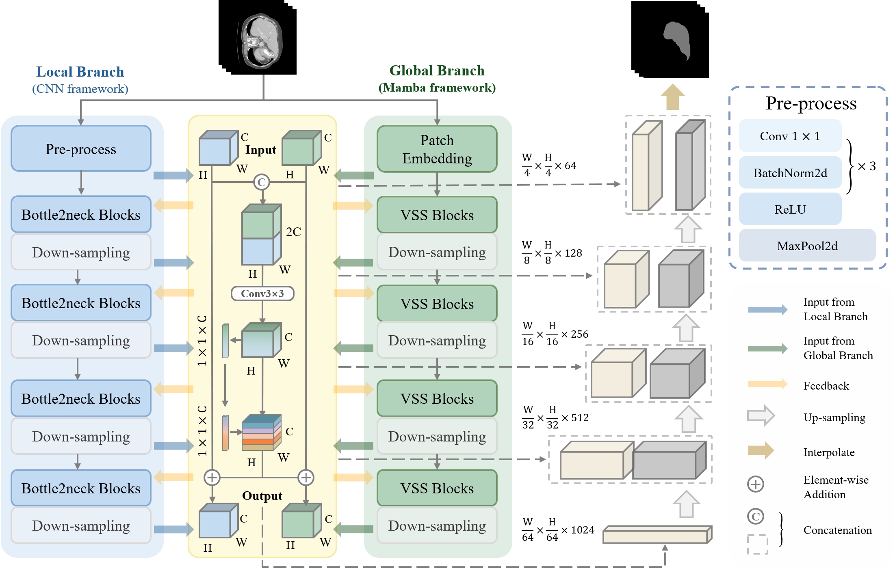

<div align="center">
<h1>CFM-UNet </h1>
<h3>CFM-UNet: Coupling Local and Global Feature Extraction Networks for Medical Image Segmentation</h3>

*Ke Niu*, Jiacheng Han, Jiuyun Cai

🔥 News: This paper has been accepted for publication by *Scientific Reports* (JCR Q1) !

</div>

## Abstract

In medical image segmentation, traditional CNN-based models excel at extracting local features but have limitations in capturing global features. Conversely, Mamba, a novel network framework, effectively captures long-range feature dependencies and excels in processing linearly arranged image inputs, albeit at the cost of overlooking fine spatial relationships and local pixel interactions. This limitation highlights the need for hybrid approaches that combine the strengths of both architectures. To address this challenge, we propose CNN-Fusion-Mamba-based U-Net (CFM-UNet). The model integrates CNN-based Bottle2neck blocks for local feature extraction and Mamba-based Visual State Space(VSS) blocks for global feature extraction. These parallel frameworks perform feature fusion through our designed SEF block, achieving complementary advantages. Experimental results demonstrate that CFM-UNet outperforms other advanced methods in segmenting medical image datasets, including liver organs, liver tumors, spine, and colon polyps, with notable generalization ability in liver organ segmentation.

## Overview

* The overall architecture of CFM-UNet. The blue and green components represent the Local Branch and Global Branch, respectively, while the yellow component denotes the SEF block feature fusion module, and the gray sections indicate the upsampling process.

<p align="center">
  
</p>

## Getting Started

### **1. Main Environments** </br>
The environment installation procedure can be followed the steps below (python=3.10):</br>

```
conda create -n cfmunet python=3.10
conda activate cfmunet
pip install torch==2.1.1 torchvision==0.16.1 torchaudio==2.1.1 --index-url https://download.pytorch.org/whl/cu118
pip install packaging
pip install timm==0.4.12
pip install pytest chardet yacs termcolor
pip install submitit tensorboardX
pip install triton==2.0.0
pip install causal_conv1d
pip install mamba_ssm
pip install scikit-learn matplotlib thop h5py SimpleITK scikit-image medpy yacs
```

### **2. Datasets** </br>
We provide here all the datasets used for training, testing, and validation (all standardized into PNG format and passwords are "1234"), specifically including the following aspects:

For human organs and tumor lesions, we segmented the classic liver dataset LiTS17, randomly selecting 1,030 liver slices and 670 liver tumor slices. To verify the model's generalization ability, we conducted transfer testing on 800 liver slices randomly selected from the open-source liver dataset ATLAS from MICCAI 2023.
- [LiTS17_Liver.zip](https://pan.baidu.com/s/1QXnJ6UqoXcEeW1XPTyVpPA)
- [LiTS17_Liver_tumor.zip](https://pan.baidu.com/s/1muaDBL8e8lV3gmTaO5uKNQ)
- [ATLAS.zip](https://pan.baidu.com/s/1nuFmaIp5JaQ62Qehxvf9-A)

For the human skeleton, we segmented the spinal skeleton from the open-source dataset SPIDER, randomly selecting 1,000 intact spinal slices. 

- [Kvasir-SEG.zip](https://pan.baidu.com/s/1-JYhJqagx5Q3dQEgIhEuFg)

For human tissues, we segmented all colon polyp images from the open-source dataset Kvasir-SEG.

- [SPIDER.zip](https://pan.baidu.com/s/1yG04Dk6aOEU3fUm3M-0P0Q)

### **3. Train Your CFM-UNet** </br>
You can try using the model in `CFMUNet.py`.

## Acknowledgement
Thanks to [VMamba](https://github.com/MzeroMiko/VMamba) and [VM-UNet](https://github.com/JCruan519/VM-UNet) for their outstanding work.
